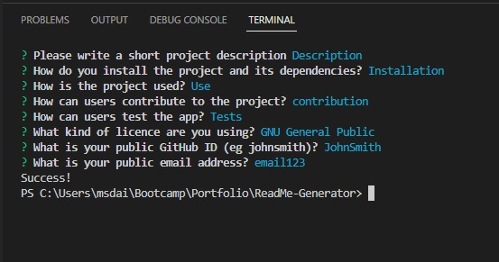

# README Generator 
  
## Description

This is a node.js application which generates a readme for your project based on input from questions 
which are prompted when 'node index.js' is run in the terminal
  
## Preview

## Table of Contents

- [Installation:](#installation) how to install this app and its dependencies
- [Usage:](#usage) How this app is used
- [Tech:](#tech) Which technologies were used in creating the app
- [Contributing:](#contributing) How to contribute to this app
- [Tests:](#tests) How to carry out tests on this app
- [Questions:](#questions) Contact information to send your questions and feeback to

## Installation

To install this project: 
  
  - Clone the repository to your computer
  - open a terminal and run `npm install inquirer`
  
## Usage

To use the readme generator:

  - Install using the instructions in the [installation](#installation) section
  - Open the terminal and run `node index.js`
  - Answer the questions
  - Open the new file ending with `--README.MD`
  - Add a preview image of your project to a file of your choosing, then add the src
  - Change the width of the preview to 

## Tech

- Javascript
- Node.js
- inquirer npm
- fs npm
  
## Contributing

This project is currently finished, but you can get in contact with any of the details in the [questions](#questions) section.
  
## Tests

To test the app, please follow these instructions:
  - Open a terminal and run `node index.js`
  - Answer the questions
  - A new markdown file should be created. If not, the error will be printed to the terminal
  
## Questions

If you have any questions or feedback about this readme generator, please get in contact with me at:
  - [GitHub:](https://github.com/daisyeverard) https://github.com/daisyeverard; 
  - Email: msdeverard@gmail.com
  
## License

MIT License